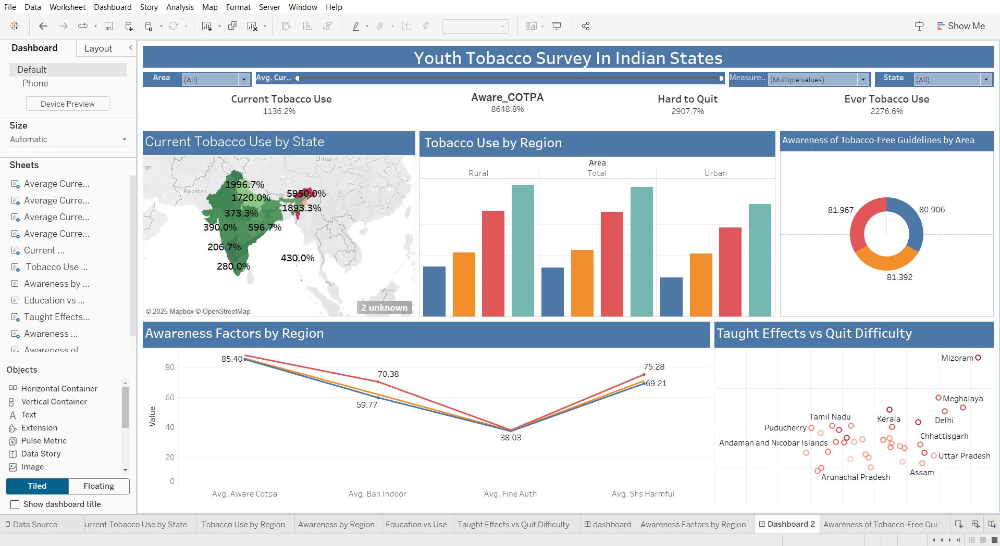

# 📊 Youth Tobacco Survey in Indian States - Dashboard Project

## 🔍 Project Overview
This project demonstrates an end-to-end data pipeline and dashboard visualization based on the **Youth Tobacco Survey** conducted across Indian states. The objective is to derive meaningful insights into tobacco consumption patterns among youth to support public health analysis and policy formulation.

## 🗂️ Data Source
- **Dataset**: Youth Tobacco Survey (sourced from [Kaggle](https://www.kaggle.com))
- **Storage**: AWS S3 Bucket
- **Warehouse**: Snowflake (connected securely using AWS IAM roles)
- The data is collected, stored, cleaned, and made available for analysis through a secure, scalable pipeline.

## 🧹 Data Pipeline & Processing

### 1. Data Collection
- Downloaded raw dataset from Kaggle.
- Uploaded to an AWS S3 bucket.

### 2. Data Integration
- Configured AWS IAM roles to grant Snowflake external stage access to AWS S3.
- Created external and internal stages in Snowflake.
- Loaded the data into Snowflake staging tables using `COPY INTO` statements.

### 3. Data Cleaning & Transformation
- Cleaned and structured data using Snowflake SQL queries.
- Handled missing/null values, formatted data types, and standardized categories for Tableau compatibility.

### 4. Visualization in Tableau
- Connected Tableau directly to Snowflake using a live connection and custom SQL.
- Created interactive dashboards for exploratory data analysis and insight delivery.

## 📈 Key Insights
- Comparative analysis of tobacco usage across Indian states.
- Gender-specific usage patterns and behavioral trends.
- Prevalence among different age groups.
- Identification of regions with higher youth tobacco consumption.
- Time-trend visualizations (if present in the dataset).

## 🛠️ Tech Stack
- **Data Source**: Kaggle
- **Storage**: AWS S3
- **Data Warehouse**: Snowflake
- **Integration**: AWS IAM roles & policies
- **Visualization**: Tableau Desktop

## ✅ Outcomes
- Developed a scalable and secure data pipeline.
- Built a Tableau dashboard for interactive analysis of youth tobacco trends.
- Delivered actionable insights to assist stakeholders in decision-making and policy implementation.

---
## Dashboad image

